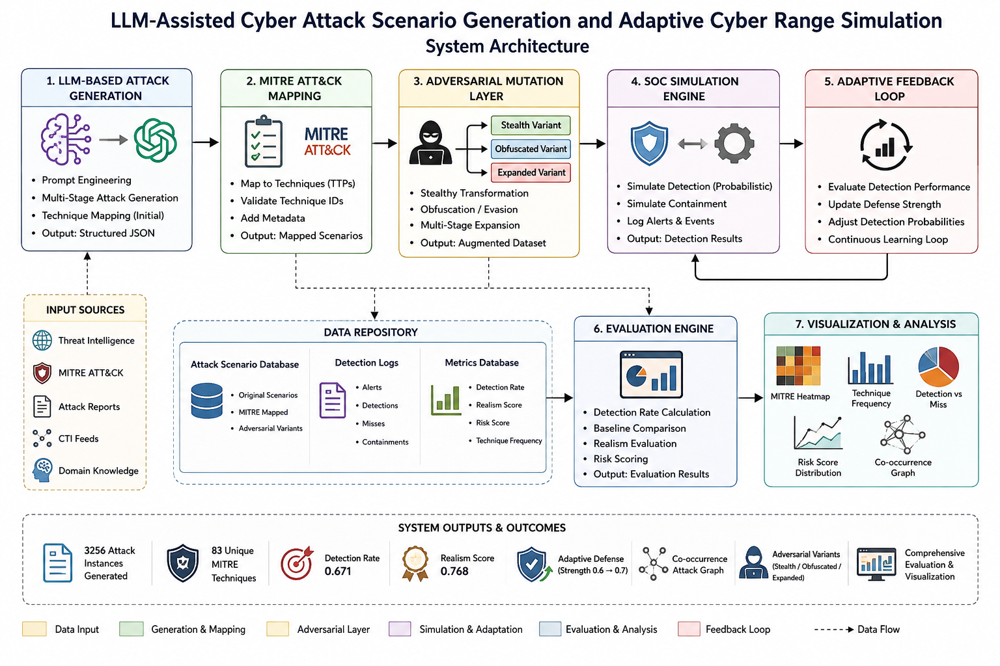

# AdverSim — LLM-Driven Adversarial Cyber Attack Simulation Framework

<p align="center">
  
</p>

<p align="center">
  <a href="https://github.com/imranalmunyeem/llm-attack-generation-cyberrange/blob/main/LICENSE">
    
  </a>
  <a href="https://www.python.org/downloads/release/python-3110/">
    
  </a>
  
  
  
  
  <a href="https://doi.org/10.5281/zenodo.20733131">
    
  </a>
</p>

> **AdverSim** is a closed-loop, LLM-assisted framework for generating MITRE ATT&CK-aligned adversarial cyber attack scenarios at scale — enabling SOC teams, cyber range operators, and detection engineers to build diverse, realistic training corpora without manual authoring.

---

## Table of Contents

- [Why AdverSim?](#why-adversim)
- [Key Results](#key-results)
- [Architecture](#architecture)
- [What's in the Repository](#whats-in-the-repository)
- [Installation](#installation)
- [Quick Start](#quick-start)
- [Detailed Usage](#detailed-usage)
  - [Generate Scenarios](#1-generate-scenarios)
  - [Run All Experiments](#2-run-all-experiments)
  - [Instrumented Generator (LLM Statistics)](#3-instrumented-generator)
  - [Diversity-Aware Generation](#4-diversity-aware-generation)
  - [ATT&CK Groups Validation](#5-attck-groups-validation)
  - [Sigma Rule Generation](#6-sigma-rule-generation)
  - [Annotation Study](#7-annotation-study)
- [Dataset](#dataset)
- [Evaluation Results](#evaluation-results)
- [Project Structure](#project-structure)
- [Citation](#citation)
- [Contributing](#contributing)
- [Contact](#contact)

---

## Why AdverSim?

Cyber range environments and detection pipelines depend on realistic, diverse attack scenarios. The problem: **creating such datasets manually takes weeks of expert effort**. Existing public datasets (CICIDS-2017, UNSW-NB15) are static, imbalanced, and disconnected from real adversary tradecraft.

AdverSim solves this by:

| Problem | AdverSim Solution |
|---|---|
| Manual scenario authoring | Automated LLM generation with structured prompts |
| Static, repetitive attack patterns | Three-mode adversarial mutation engine |
| No MITRE ATT&CK alignment | Technique ID validation + re-query loop |
| Unknown scenario quality | Cross-validated composite realism metric |
| No feedback loop | Closed-loop SOC simulation with adaptive defence |
| Detection rules not generated | Sigma-compatible rule skeleton output |

**Cost:** A 1,000-scenario base corpus costs **$0.34 USD** and takes **~120 minutes** to generate.

---

## Key Results

| Metric | Value |
|---|---|
| Base scenarios generated | 1,000 (490 fixed-prompt + 510 diversity-aware) |
| Augmented corpus (after mutation) | 4,000 instances |
| Unique MITRE ATT&CK identifiers | 160 (121 active v14 + 39 pre-v14 legacy) |
| ATT&CK v14 base-technique coverage | **60.2%** (121/201) |
| LLM first-attempt validation pass rate | **100%** (Wilson 95% CI: [0.984, 1.000], n=240) |
| Cost per scenario | **$0.000342 USD** |
| Obfuscation mutation Jaccard | **0.015** (98.5% technique substitution) |
| Realism metric (cross-validated) | **R̄ = 0.945 ± 0.005** (5-fold, n=1,000) |
| ATT&CK groups transition overlap | **53.6%** (Spearman ρ=0.122, p=0.003, n=170 groups) |
| Sigma detection rules generated | **48 rules** across 5 log source categories |
| Top matching ATT&CK group | Sandworm Team (Jaccard=0.201, 50.6% coverage) |

---

## Architecture

AdverSim comprises **seven integrated modules**:

```
┌─────────────────────────────────────────────────────────────────┐
│                        AdverSim Pipeline                         │
│                                                                   │
│  [Input]  Environment × Attack Type × Difficulty                 │
│      │                                                            │
│      ▼                                                            │
│  ┌───────────────┐   ┌────────────────┐   ┌───────────────────┐ │
│  │ 1. LLM-Based  │──▶│ 2. MITRE ATT&CK│──▶│ 3. Adversarial    │ │
│  │    Generator  │   │    Mapper      │   │    Mutation Engine│ │
│  │  (GPT-4o-mini)│   │ (v14 validate) │   │ stealth/obfusc/   │ │
│  └───────────────┘   └────────────────┘   │ expand            │ │
│                                            └───────────────────┘ │
│                                                      │            │
│      ┌───────────────────────────────────────────────┘            │
│      ▼                                                            │
│  ┌───────────────┐   ┌────────────────┐   ┌───────────────────┐ │
│  │ 4. Attack     │──▶│ 5. SOC         │──▶│ 6. Evaluation &   │ │
│  │    Graph      │   │    Simulation  │   │    Analytics      │ │
│  │    Builder    │   │ (adaptive D_t) │   │    Engine         │ │
│  └───────────────┘   └────────────────┘   └───────────────────┘ │
│                                                      │            │
│                              ┌───────────────────────┘            │
│                              ▼                                    │
│                    ┌───────────────────┐                          │
│                    │ 7. Visualisation  │                          │
│                    │    Layer          │                          │
│                    └───────────────────┘                          │
│                                                                   │
│  [Output] JSONL corpus + Figures + Sigma rules + Reports         │
└─────────────────────────────────────────────────────────────────┘
```

---

## What's in the Repository

Paper-facing method artifacts:

- `docs/PAPER_METHODS_ALGORITHMS.md` - system architecture, pseudocode, and complexity notes.
- `paper/methods_algorithms.tex` - LaTeX-ready methods appendix content.
- `docs/PAPER_VALIDITY_ETHICS_REPRODUCIBILITY.md` - threats to validity, ethics, artifact availability, ablation table, and data/model card.
- `paper/validity_ethics_reproducibility.tex` - LaTeX-ready validity, ethics, and reproducibility section.
- `docs/PHASE_9_MANUSCRIPT_MACRO_WIRING.md` - manuscript macro-wiring workflow and CI drift checks.
- `paper/manuscript_draft.tex` - macro-wired manuscript scaffold.
- `docs/TABLE_XVI_REPRODUCIBILITY.md` - Table XVI reproducibility map.
- `paper/table_xvi_reproducibility.tex` - LaTeX-ready Table XVI.
- `docs/SUBMISSION_CHECKLIST.md` - pre-submission QA checklist.
- `docs/ANTICIPATED_REVIEWERS.md` - anticipated reviewer concerns and concise responses.
- `docs/PHASE_CLOSEOUT_AUDIT.md` - closeout status for the remaining phases.

| Script | Purpose | Needs API Key |
|---|---|---|
| `core/llm_generator.py` | Core LLM scenario generation | Yes |
| `core/mitre_mapper.py` | ATT&CK technique validation | No |
| `core/adversarial_mutator.py` | Three-mode mutation engine | No |
| `core/simulation_engine.py` | SOC detection simulation | No |
| `core/evaluation_engine.py` | Metrics computation | No |
| `run_dataset.py` | Generate a new scenario corpus | Yes |
| `run_metrics.py` | Compute metrics on existing corpus | No |
| `journal_experiments.py` | Run all 10 paper experiments | No |
| `instrumented_generator.py` | LLM telemetry & reliability stats | Yes |
| `diverse_generator.py` | Diversity-aware scenario generation | Yes |
| `attck_groups_validation.py` | External validation vs real threat actors | Yes (internet) |
| `sigma_rule_generator.py` | Generate Sigma detection rules | No |
| `annotation_sampler.py` | Export scenarios for human annotation | No |

| Dataset | Size | Description |
|---|---|---|
| `dataset/dataset.jsonl` | 490 scenarios | Fixed-prompt base corpus |
| `dataset/full_dataset.jsonl` | 1,000 scenarios | Full corpus (fixed + diverse) |

---

## Installation

### Prerequisites

- Python 3.11+
- OpenAI API key (for generation scripts only)
- 8 GB RAM, standard workstation (no GPU required)

### Step 1 — Clone the repository

```bash
git clone https://github.com/imranalmunyeem/llm-attack-generation-cyberrange.git
cd llm-attack-generation-cyberrange
```

### Step 2 — Create a virtual environment

```bash
python -m venv venv

# Windows
venv\Scripts\activate

# macOS / Linux
source venv/bin/activate
```

### Step 3 — Install dependencies

```bash
pip install -r requirements.txt
```

### Step 4 — Configure your API key

Open `configs/settings.py` and set your OpenAI API key:

```python
OPENAI_API_KEY = "sk-your-key-here"
```

Or set it as an environment variable:

```bash
# Windows
set OPENAI_API_KEY=sk-your-key-here

# macOS / Linux
export OPENAI_API_KEY=sk-your-key-here
```

---

## Quick Start

### Option A — Use the existing dataset (no API key needed)

Run all 10 journal experiments on the 1,000-scenario corpus and generate all paper figures:

```bash
python journal_experiments.py
```

Results saved to `data/journal_results/` — includes `all_results.json` and all figures.

### Option B — Generate new scenarios (API key required)

```bash
python run_dataset.py
```

Generates a new scenario corpus and saves to `dataset/`.

---

## Detailed Usage

### 1. Generate Scenarios

**`run_dataset.py`** — Generates the base scenario corpus.

```bash
python run_dataset.py
```

Each generated scenario is a JSON object with this structure:

```json
{
  "scenario_id": "APT-ENT-H-0042",
  "attack_type": "APT",
  "environment_type": "Enterprise Network",
  "difficulty": "Hard",
  "realism_score": 0.97,
  "narrative": "An advanced persistent threat...",
  "attack_stages": [
    {
      "stage_name": "Reconnaissance",
      "description": "...",
      "techniques": [
        {"technique_id": "T1595", "technique_name": "Active Scanning"}
      ]
    }
  ],
  "mitre_attack_mapping": ["T1595", "T1566.001", "T1078"],
  "attack_graph": {
    "nodes": ["Reconnaissance", "Initial Access", "Execution"],
    "edges": [["Reconnaissance", "Initial Access"], ["Initial Access", "Execution"]]
  }
}
```

**Parameters (configurable in `configs/settings.py`):**

| Parameter | Options | Default |
|---|---|---|
| `ATTACK_TYPES` | Phishing, Ransomware, Insider Threat, APT | All four |
| `ENVIRONMENTS` | Enterprise Network, Cloud Infrastructure, Healthcare, ICS | All four |
| `DIFFICULTIES` | Easy, Medium, Hard | All three |

---

### 2. Run All Experiments

**`journal_experiments.py`** — Runs all 10 evaluation experiments used in the paper. No API key needed — runs on existing JSONL dataset.

```bash
python journal_experiments.py
```

**What it produces:**

| Experiment | Output | Paper Section |
|---|---|---|
| EXP 1 | Per-environment detection breakdown | Table IV |
| EXP 2 | Per-attack-type with 95% CIs | Table V |
| EXP 3 | Realism sub-component scores (T, G, S) | Table VI |
| EXP 4 | 5-fold cross-validation of realism metric | Table VII |
| EXP 5 | Mutation impact + Jaccard diversity | Table VIII |
| EXP 6 | MTTD distribution (box plots + histogram) | Table IX + Figs |
| EXP 7 | Statistical significance tests | Table XI |
| EXP 8 | Graph structural properties (NetworkX) | Table X |
| EXP 9 | Technique diversity accumulation curve | Fig 11 |
| EXP 10 | Extended ablation study | Table XIV |

To point at a different dataset:

```python
# At top of journal_experiments.py, change:
DATASET = os.path.join(BASE_DIR, "dataset", "full_dataset.jsonl")
```

---

### 3. Instrumented Generator

**`instrumented_generator.py`** — Generates scenarios while tracking LLM reliability statistics. Use this to validate the pipeline or reproduce Table XII from the paper.

```bash
# Recommended: n=240 for journal-grade statistics
# (5 samples per each of 48 parameter combinations)
python instrumented_generator.py --n 240 --out data/journal_results/

# Quick pilot run (n=20, ~2.5 min, ~$0.007)
python instrumented_generator.py --n 20 --out data/journal_results/
```

**Tracked metrics:**
- First-attempt validation pass rate + Wilson 95% CI
- Re-query success/failure rate
- Invalid technique IDs found (by attack type, environment, difficulty)
- Average generation time per scenario
- Total token usage and estimated cost

**Expected output (n=240):**
```
Scenarios attempted    : 240
Scenarios accepted     : 240 (100%)
First-attempt pass     : 100.0%
Wilson 95% CI          : [0.984, 1.000]
Avg generation time    : 7.41s ± 1.90s
Cost per scenario      : $0.000342
Est. cost 1,000-corpus : $0.342
```

---

### 4. Diversity-Aware Generation

**`diverse_generator.py`** — Generates additional scenarios using threat-actor-persona prompts to break the technique vocabulary saturation that occurs at N≈6 with fixed prompts.

```bash
# Generate 510 diverse scenarios (recommended to reach 1,000 total)
python diverse_generator.py --n 510 --out dataset/diverse/

# After generation, merge with existing corpus:
# Windows
type dataset\dataset.jsonl dataset\diverse\diverse_scenarios.jsonl > dataset\full_dataset.jsonl

# macOS / Linux
cat dataset/dataset.jsonl dataset/diverse/diverse_scenarios.jsonl > dataset/full_dataset.jsonl

# Re-run experiments on the merged corpus
python journal_experiments.py
```

**Diversity dimensions used:**
- **Threat actor personas:** Lazarus Group, APT28, APT41, FIN7, REvil, Conti, and more
- **Industry verticals:** Financial services, pharmaceutical, telecommunications, government
- **TTP focus areas:** Living-off-the-land, supply chain compromise, lateral movement
- **Campaign objectives:** Financial theft, espionage, ransomware, destructive attacks
- **OPSEC levels:** High-stealth (slow/patient) to low-OPSEC (fast/noisy)

**Why it matters:**

```
Fixed prompts only (N=490):   82 unique technique IDs  (saturation at N≈6)
After diverse prompts (N=1000): 160 unique technique IDs  (+78 new techniques)
```

---

### 5. ATT&CK Groups Validation

**`attck_groups_validation.py`** — Validates generated scenario technique patterns against 170 real-world ATT&CK threat groups.

```bash
pip install requests mitreattack-python
python attck_groups_validation.py
```

**What it does:**
1. Downloads ATT&CK v14 enterprise STIX bundle (~15MB, cached after first run)
2. Extracts technique sets from all documented threat groups
3. Compares co-occurrence patterns with generated corpus
4. Reports Spearman correlation and group-level Jaccard similarity

**Results from paper:**

| Metric | Value |
|---|---|
| Technique transition overlap | 53.6% |
| Weighted overlap | 54.7% |
| Spearman ρ | 0.122 (p=0.003) |
| Top group: Sandworm Team | Jaccard=0.201, 50.6% coverage |
| Top group: APT28 | Jaccard=0.199, 45.2% coverage |
| Top group: APT41 | Jaccard=0.198, 48.8% coverage |

---

### 6. Sigma Rule Generation

**`sigma_rule_generator.py`** — Generates Sigma-compatible detection rule skeletons from scenario technique IDs and indicators.

```bash
python sigma_rule_generator.py \
  --dataset dataset/full_dataset.jsonl \
  --out data/journal_results/sigma_rules/ \
  --n 50
```

**Sample generated rule:**

```yaml
title: AdverSim - APT Indicator in Enterprise Network
id: adversim-000001
status: test
description: >
  Detects indicators of a simulated APT scenario targeting Enterprise Network.
  ATT&CK stage: Reconnaissance.
logsource:
  category: process_creation
  product: any
  service: security
detection:
  keywords:
    - active_scanning
  condition: keywords
tags:
  - attack.t1595
  - attack.t1566_001
level: low
```

Rules require field-name tuning for your specific SIEM before operational deployment. They are designed as structural templates aligned to ATT&CK data source metadata.

---

### 7. Annotation Study

**`annotation_sampler.py`** — Exports a stratified scenario sample as CSV for human expert annotation. Use this to compute external Fleiss' κ inter-rater agreement.

```bash
python annotation_sampler.py \
  --dataset dataset/full_dataset.jsonl \
  --out data/journal_results/annotation/ \
  --n 100
```

**Produces:**
- `annotation_study_scenarios.csv` — scenario descriptions for annotators to read
- `annotation_template.csv` — blank rating sheet (1–5 Likert scale, three dimensions)
- `instructions.txt` — email template for external annotators

**Annotation dimensions:** ATT&CK Alignment · Stage Sequence · Overall Realism

---

## Dataset

### Full Dataset — `dataset/full_dataset.jsonl`

1,000 independently generated base scenarios, augmented to **4,000 instances** via three-mode mutation.

**Composition:**

| Attack Type | Enterprise | Cloud | Healthcare | ICS | Total |
|---|---|---|---|---|---|
| Phishing | 120 | 64 | 56 | 32 | **272** |
| Ransomware | 96 | 68 | 56 | 42 | **262** |
| Insider Threat | 96 | 13 | 56 | 58 | **223** |
| APT | 100 | 4 | 34 | 105 | **243** |
| **Total** | **412** | **149** | **202** | **237** | **1,000** |

**Generation breakdown:**
- 490 scenarios: fixed prompts (4 attack types × 4 environments × 3 difficulties)
- 510 scenarios: diversity-aware prompts (threat-actor personas × industry verticals × TTP focus)

**ATT&CK coverage:**
- 121 confirmed active ATT&CK v14 enterprise techniques (κ = 60.2%)
- 39 pre-v14 legacy identifiers (reflecting LLM's historical ATT&CK knowledge)
- 160 total unique MITRE technique identifiers

**Per-tactic breakdown:**

| Tactic | Active v14 Techniques |
|---|---|
| Execution | 14 |
| Credential Access | 13 |
| Initial Access | 12 |
| Defense Evasion | 11 |
| Impact | 10 |
| Persistence | 10 |
| Discovery | 9 |
| Reconnaissance | 8 |
| Command & Control | 8 |
| Lateral Movement | 7 |
| Exfiltration | 6 |
| Collection | 6 |
| Privilege Escalation | 4 |
| Resource Development | 3 |

**Licence:** Defensive research and training use only. Not for offensive operations.

---

## Evaluation Results

### Detection Performance by Environment

| Environment | n | Detection Rate (95% CI) | Containment Rate | MTTD (min) |
|---|---|---|---|---|
| Cloud Infrastructure | 149 | 0.671 [0.636, 0.703] | 0.354 | 78.4 |
| Enterprise Network | 412 | 0.649 [0.628, 0.669] | 0.379 | 76.0 |
| Healthcare | 202 | 0.649 [0.618, 0.676] | 0.370 | 70.9 |
| ICS | 237 | 0.678 [0.650, 0.705] | 0.358 | 72.5 |

### Detection Performance by Attack Type

| Attack Type | Detection Rate (95% CI) | MTTD (min) | Realism |
|---|---|---|---|
| APT | 0.742 [0.718, 0.766] | 82.9 | 0.858 |
| Ransomware | 0.653 [0.627, 0.679] | 76.4 | 0.839 |
| Insider Threat | 0.627 [0.597, 0.657] | 72.9 | 0.832 |
| Phishing | 0.624 [0.598, 0.650] | 76.4 | 0.832 |

### Realism Metric (Cross-Validated)

| Fold | G(S) | R(S) | Test size |
|---|---|---|---|
| 1 | 0.8740 | 0.9484 | 200 |
| 2 | 0.8668 | 0.9494 | 200 |
| 3 | 0.8658 | 0.9461 | 200 |
| 4 | 0.8616 | 0.9467 | 200 |
| 5 | 0.8398 | 0.9363 | 200 |
| **Mean ± SD** | **0.862 ± 0.012** | **0.945 ± 0.005** | — |

### Mutation Impact

| Variant | Detection Rate | ΔDR | Realism | Jaccard |
|---|---|---|---|---|
| Base | 0.680 | — | 0.952 | 1.000 |
| Stealth | 0.687 | +0.007 | 0.935 | 0.930 |
| Obfuscated | 0.663 | −0.017 | 0.656 | **0.015** |
| Expanded | 0.823 | +0.143 | 0.884 | 0.771 |

### Ablation Study

| Configuration | Detection Rate | Realism | MTTD (min) |
|---|---|---|---|
| Full Framework | 0.671 | 0.922 | 67.9 |
| w/o Mutation Engine | 0.667 | 0.952 | 71.2 |
| w/o MITRE Mapper | 0.665 | 0.500* | 71.6 |
| w/o Graph Builder | 0.692 | 0.922 | 77.0 |
| w/o SOC Feedback | 0.616 | 0.922 | 76.4 |
| w/o Realism Scoring | 0.679 | — | 73.7 |
| LLM Only | 0.632 | 0.500* | 79.0 |

*Degraded fallback score when technique validation unavailable.

---

## Project Structure

```
llm-attack-generation-cyberrange/
│
├── core/                          # Core pipeline modules
│   ├── llm_generator.py           # LLM-based scenario generation
│   ├── mitre_mapper.py            # ATT&CK v14 technique validation
│   ├── adversarial_mutator.py     # Stealth / obfuscation / expansion
│   ├── simulation_engine.py       # SOC detection simulation
│   ├── evaluation_engine.py       # Metrics computation
│   ├── feedback_loop.py           # Adaptive defence strength update
│   ├── graph_builder.py           # Attack graph construction (NetworkX)
│   ├── metrics_engine.py          # DR / CR / MTTD / realism
│   ├── scenario_builder.py        # Scenario schema and parsing
│   └── config.py                  # API key and global settings
│
├── configs/
│   └── settings.py                # User configuration (API key etc.)
│
├── dataset/
│   ├── dataset.jsonl              # 490-scenario fixed-prompt corpus
│   └── full_dataset.jsonl         # 1,000-scenario full corpus
│
├── data/
│   ├── architecture.png           # System architecture diagram
│   ├── journal_results/           # All experiment outputs
│   │   ├── all_results.json       # All numerical results
│   │   ├── figures/               # All publication figures (PNG)
│   │   ├── sigma_rules/           # Generated Sigma detection rules
│   │   └── annotation/            # Annotation study export
│   └── *.png                      # Individual analysis figures
│
├── journal_experiments.py         # All 10 paper experiments (no API)
├── instrumented_generator.py      # LLM reliability tracking
├── diverse_generator.py           # Threat-actor-persona generation
├── attck_groups_validation.py     # External ATT&CK validation
├── sigma_rule_generator.py        # Sigma detection rule output
├── annotation_sampler.py          # Human annotation export
│
├── run_dataset.py                 # Generate new scenario corpus
├── run_metrics.py                 # Compute metrics on corpus
├── run_simulation.py              # Run SOC simulation
│
├── evaluation/
│   └── scoring.py                 # Evaluation helper functions
│
├── utils/
│   ├── dedup.py                   # Scenario deduplication
│   ├── export.py                  # Export utilities
│   └── logger.py                  # Logging configuration
│
├── requirements.txt               # Python dependencies
├── docker-compose.yml             # Docker setup
└── README.md                      # This file
```

---

## Dependencies

```
openai>=1.0.0
networkx>=3.2
mitreattack-python>=3.0
scipy>=1.11
numpy>=1.24
matplotlib>=3.7
pandas>=2.0
requests>=2.31
pyyaml>=6.0
scikit-learn>=1.3
```

Install all:
```bash
pip install -r requirements.txt
```

---

## Reproducing the Paper

The tracked aggregate results, figures, registry, manuscript macros, and smoke
pipeline can be reproduced offline:

```bash
make env
make reproduce
```

Before submission, run:

```bash
make submission-qa
```

Fresh full generation is intentionally separate because it may spend API budget
and writes large ignored corpora:

```bash
# Plan the 5,000-scenario Phase 0.5 corpus without API calls
make scaleup-plan

# Run the full paid API generation and resume if interrupted
make scaleup-full

# Run the exact-size Phase 5 multi-model replication
make multimodel-exact-size
```

Set `ADVERSIM_RELEASE_URL` before `make scaleup-full` if the citable release URL
is already known. Otherwise, upload the ignored full corpus after generation and
record the release URL in the manifest before claiming a public full-scale
artifact.

---

## Citation

This repository is archived through Zenodo's GitHub integration. The all-versions software DOI is [`10.5281/zenodo.20733131`](https://doi.org/10.5281/zenodo.20733131), and the exact `v1.0.0` code-release DOI is [`10.5281/zenodo.20733132`](https://doi.org/10.5281/zenodo.20733132).

If you use AdverSim in your research, please cite:

```bibtex
@article{munyeem2026adversim,
  author  = {Al Munyeem, Imran},
  title   = {{LLM-Driven Adaptive Adversarial Cyber Attack Simulation:
              A MITRE ATT\&CK-Aligned Framework with Adversarial Mutation,
              Closed-Loop SOC Evaluation, and Graph-Based Structural Analysis}},
  journal = {IEEE Access},
  year    = {2026},
  note    = {Under review},
  url     = {https://github.com/imranalmunyeem/llm-attack-generation-cyberrange}
}
```

---

## Contributing

Contributions are welcome! Particularly:

- **New attack types** — Add beyond Phishing/Ransomware/Insider/APT
- **New environments** — Extend beyond the four current deployment environments
- **Richer mutation** — Implement embedding-based obfuscation (as described in the paper)
- **SIEM integration** — Direct Elastic/Splunk/Sentinel export
- **ATT&CK version updates** — Keep the validator in sync with new ATT&CK releases

**To contribute:**

```bash
git checkout -b feature/your-feature-name
# make your changes
git commit -m "feat: description of change"
git push origin feature/your-feature-name
# open a Pull Request
```

---

## Licence

This project is licensed under the **MIT Licence** — see [LICENSE](LICENSE) for details.

**Important:** The generated scenario corpus is licenced for **defensive research and training purposes only**. Use in active offensive operations is prohibited.

---

## Contact

**Imran Al Munyeem**
Software Test Engineer, Easyask24 Ltd., Luton, UK

- Email: munyeem.swe@gmail.com
- GitHub: [@imranalmunyeem](https://github.com/imranalmunyeem)
- ORCID: [0009-0007-3538-1172](https://orcid.org/0009-0007-3538-1172)

---

<p align="center">
  Built for the cybersecurity research community · IEEE Access 2026
</p>
