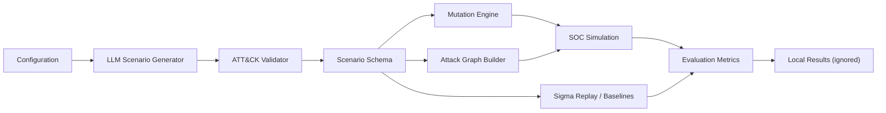

# AdverSim

AdverSim is a reproducible Python research codebase for generating, validating, mutating, and evaluating MITRE ATT&CK-aligned adversarial cyber-range scenarios.

The public repository is intentionally code-first. Manuscript drafts, reviewer material, generated corpora, analysis outputs, and submission figures are kept local-only so the paper can remain private until publication.

## Why

Cyber-range and SOC evaluation workflows often need attack scenarios that are structured, diverse, and mapped to a threat framework. AdverSim provides a repeatable pipeline for:

- generating scenario JSON from configurable attack/environment/difficulty inputs;
- validating ATT&CK technique identifiers against pinned matrix data;
- applying adversarial mutations for robustness testing;
- simulating detection/containment behavior;
- replaying Sigma-style detection logic against event fixtures;
- scaling generation runs when an API key and budget are available.

The code is designed for defensive research, detection engineering, and reproducibility experiments. It is not an operational offensive toolkit.

## Architecture



## Repository Layout

```text
analysis/        Reproducible analysis and robustness scripts
annotation/      Human-rating harness code (private packets ignored)
app/             Application entry points
baselines/       Baseline comparison utilities
configs/         Runtime settings
core/            Scenario generation, validation, mutation, simulation, metrics
cyber_range/     Local range helpers
detection/       Sigma replay and log normalization utilities
evaluation/      Scoring helpers
mitre/           ATT&CK mapping utilities and pinned public technique data
scaleup/         Paid/API-backed corpus scale-up runners
scripts/         Environment, CI, and repository hygiene scripts
tests/           Offline smoke tests and small fixtures
utils/           Shared helpers
visualization/   Graph visualization helpers
```

Local-only paths ignored by git:

```text
paper/           Private manuscript, submission notes, and paper package
paper_assets/    Private figures and screenshots
results/         Generated analysis outputs
data/            Generated corpora, logs, charts, and downloaded datasets
docs/            Private manuscript notes and submission checklists
```

## Quick Start

Use Python 3.11 or newer.

```bash
git clone https://github.com/imranalmunyeem/llm-attack-generation-cyberrange.git
cd llm-attack-generation-cyberrange
python -m venv .venv
```

Activate the environment:

```bash
# Windows PowerShell
.\.venv\Scripts\Activate.ps1

# macOS / Linux
source .venv/bin/activate
```

Install dependencies:

```bash
python -m pip install --upgrade pip
python -m pip install -r requirements.lock
```

## API Configuration

API-backed generation reads credentials from environment variables. Keep secrets in `.env`; it is ignored by git.

```bash
OPENAI_API_KEY=sk-...
```

Do not commit `.env`, API keys, downloaded logs, generated corpora, paper drafts, or result artifacts.

## Reproduce the Code Path

Run the offline smoke pipeline:

```bash
make smoke
```

Run the public reproducibility CI checks:

```bash
make reproducibility-ci
```

Run repository hygiene checks before pushing:

```bash
make pre-push-check
```

These checks compile key modules and run the fixture-backed pipeline. They do not require private paper artifacts.

## Generate Scenarios

Small API-backed generation:

```bash
python run_dataset.py
```

Corpus scale-up dry run:

```bash
make scaleup-plan
```

Full paid scale-up run:

```bash
make scaleup-full
```

Generated outputs are written under ignored local paths such as `data/generated/` and should be released separately only when you are ready to publish the artifact.

## Useful Commands

```bash
make env                    # Create/update local environment
make smoke                  # Offline smoke pipeline
make sigma-replay-sample    # Run Sigma replay against tracked fixtures
make scaleup-plan           # Plan a large generation run without API calls
make scaleup-small          # Small API-backed scale-up run
make multimodel-plan        # Plan multi-model replication
make pre-push-check         # Size and secret hygiene checks
```

## Data Policy

The GitHub repository should contain reproducible source code, lightweight fixtures, dependency files, and pinned public reference data needed for tests. Large generated corpora, manuscript material, human-rating packets, raw logs, paper figures, and result tables stay local-only until a separate release is intentionally created.

For a paper artifact release, upload generated corpora to a dedicated archive such as Zenodo, OSF, or a GitHub Release, then cite that release from the manuscript. Keep the manuscript itself outside the public code branch until submission/publication timing is appropriate.

## Safety Scope

AdverSim is intended for defensive simulation, cyber-range education, and detection engineering research. Generated scenarios and rules require human review before operational use.

## License

MIT License. See `LICENSE` when present in the repository.
