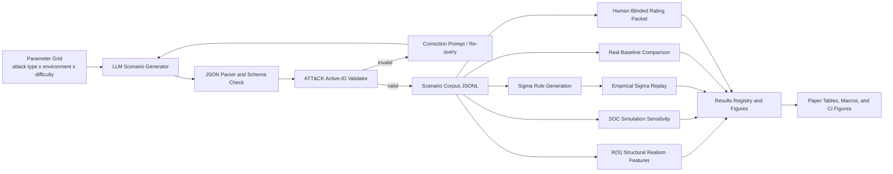

# Paper Methods: Algorithms, Complexity, and Architecture

This document consolidates the system-level description that should appear in
the paper or an appendix. It is intentionally paper-facing: it names the
algorithmic units, gives pseudocode, defines complexity variables, and states
which parts are empirical, cached, or human-validated.

## Notation

| Symbol | Meaning |
|---|---|
| `N` | Number of generated scenarios. |
| `R` | Maximum re-query attempts per scenario after the first LLM call. |
| `L` | Length of one generated JSON response in tokens or characters. |
| `S` | Number of stages in one scenario. |
| `T` | Number of ATT&CK technique mentions in one scenario. |
| `G` | Number of attack-graph edges in one scenario. |
| `K` | Number of active ATT&CK techniques in the local matrix index. |
| `P` | Number of ATT&CK group co-occurrence pairs in the reference index. |
| `M` | Number of generated Sigma rules. |
| `E` | Number of replay log events. |
| `H` | Number of human reviewers. |
| `B` | Number of bootstrap or permutation resamples. |

LLM inference dominates wall-clock generation cost. The complexity statements
below separate remote LLM cost from local parsing, validation, scoring, and
analysis.

## System Architecture



The architecture is best described as a validate-and-requery generation loop
followed by offline evaluation layers. The generation layer uses the API key;
the validation, scoring, baselines, human-rating aggregation, figure
regeneration, and CI smoke tests are offline.

## Algorithm 1: Validate-and-Requery Scenario Generation

Purpose: generate structured attack scenarios and prevent invalid or inactive
ATT&CK IDs from silently entering the corpus.

```text
Input: parameter tuples X, ATT&CK active technique set A, max re-query R
Output: accepted scenario corpus C and telemetry report Q

C <- empty list
Q <- empty telemetry table

for each tuple x = (attack_type, environment, difficulty) in X:
    prompt <- build_prompt(x)
    accepted <- false

    for attempt in 0..R:
        raw <- call_llm(prompt)
        parsed <- parse_json(raw)

        if parsed is invalid JSON:
            prompt <- correction_prompt(x, "return valid JSON")
            record parse failure in Q
            continue

        issues <- validate_schema_and_attck(parsed, A)

        if issues is empty:
            C.append(parsed)
            record accepted scenario and attempt count in Q
            accepted <- true
            break

        prompt <- correction_prompt(x, issues)
        record invalid IDs and missing fields in Q

    if accepted is false:
        record rejection in Q

return C, Q
```

Complexity:

- Remote cost: `O(N * (R + 1) * LLM(L))`.
- Local time: `O(N * (R + 1) * (L + T + S + G))`.
- Local space: `O(N * (L + T + S + G) + K)`.

## Algorithm 2: ATT&CK Validation and Canonicalization

Purpose: make every technique check depend on one matrix snapshot rather than
mixed or stale ATT&CK lists.

```text
Input: scenario s, active ATT&CK set A
Output: validation issues

issues <- empty list

if required schema fields are missing:
    issues.add(missing field names)

for each stage in s.attack_stages:
    if stage.techniques is empty:
        issues.add("stage has no technique")

    for each technique in stage.techniques:
        tid <- normalize technique.technique_id
        if tid not in A:
            issues.add(tid)

for each tid in s.mitre_attack_mapping:
    tid <- normalize tid
    if tid not in A:
        issues.add(tid)

return issues
```

Complexity:

- Time per scenario: `O(T + S)`.
- Space per scenario: `O(T)` for issue collection.
- The active ATT&CK index supports expected `O(1)` membership checks.

## Algorithm 3: R(S) Structural Realism Score

Purpose: compute a reproducible structural score that measures ATT&CK validity,
scenario completeness, and transition coherence. Phase 7 shows this score is
not a substitute for human realism judgment.

```text
Input: scenario s, active technique set A, ATT&CK group pair set Pairs
Output: R(S)

tids <- ordered technique IDs extracted from s.attack_stages
active_validity <- count(tid in A for tid in tids) / max(1, len(tids))

stage_count <- len(s.attack_stages)
edge_count <- len(s.attack_graph.edges)
structure <- min(1,
                 0.6 * stage_count / 4
                 + 0.4 * edge_count / max(1, stage_count - 1))

transition_pairs <- adjacent unordered pairs from tids
transition_coherence <- count(pair in Pairs for pair in transition_pairs)
                        / max(1, len(transition_pairs))

return 0.40 * active_validity
       + 0.35 * structure
       + 0.25 * transition_coherence
```

Complexity:

- Reference pair construction: `O(sum_g k_g^2)` where `k_g` is the number of
  active techniques associated with ATT&CK group `g`; stored as `P` pairs.
- Time per scenario: `O(T + S + G)`.
- Space: `O(P + T)`.

## Algorithm 4: SOC Simulation Sensitivity

Purpose: test which SOC-simulation claims are stable under alternate detection
assumptions, and mark artifact-prone findings honestly.

```text
Input: scenarios C, parameter grid Theta
Output: sensitivity table and invariance labels

for each theta in Theta:
    for each scenario s in C:
        for each stage i in s.attack_stages:
            p_i <- detection_probability(stage_i, s, theta)
            update scenario detection probability
            update expected time-to-detect

    aggregate results by attack type, environment, difficulty, and stage count
    store run-level rankings

for each aggregate dimension:
    compare rankings across all theta
    if all pairwise orderings are stable:
        label as invariant
    else:
        label as parameter-sensitive

label stage-count monotonicity as model-artifact when it follows directly from
the independent per-stage Bernoulli detection model.
```

Complexity:

- Time: `O(|Theta| * N * S)`.
- Space: `O(|Theta| * D + N)` where `D` is the number of aggregate buckets.

## Algorithm 5: Sigma Rule Generation and Replay

Purpose: convert scenarios into tangible detection-rule skeletons and evaluate
them against labelled defensive events.

```text
Input: scenario corpus C, rule count M, labelled events E
Output: Sigma rules and measured replay coverage

for each selected scenario s in C[1..M]:
    focus_stage <- first high-signal stage if present, else first stage
    focus_tid <- first valid technique in focus_stage
    logsource <- map focus_tid to Sigma logsource
    keywords <- technique names and selected indicator terms
    write Sigma YAML rule

for each event e in events:
    labels <- extract ATT&CK labels from known event fields and tags
    haystack <- flattened lowercase event text

    for each Sigma rule r:
        if logsource is compatible and any keyword appears in haystack:
            record alert
            record true positive if labels intersect r.techniques

aggregate technique coverage and true/false positive counts
```

Complexity:

- Rule generation time: `O(M * (T + L_s))`, where `L_s` is stage text length.
- Replay time: `O(E * M * W)` with simple keyword matching, where `W` is the
  average number of rule keywords. This is intentionally transparent rather
  than optimized.
- Space: `O(M + E_labels + alerts)`.

## Algorithm 6: Human Realism Validation

Purpose: de-bias the automatic metric by comparing it with blinded human
ratings.

```text
Input: corpus C, sample size n, reviewers H
Output: agreement, aggregate ratings, R(S)-human association

sample <- stratified_sample(C, n, by attack_type x environment x difficulty)

for each scenario s in sample:
    blind_id <- stable hash of seed and sample position
    write blinded scenario row
    write empty rating-template row
    write hidden blind-key row with R(S) features

collect H completed rating templates

for each blind_id:
    aggregate mean ATT&CK alignment, stage-sequence realism, and overall realism

compute Krippendorff ordinal alpha for each dimension
compute Spearman correlation between R(S) and mean human overall realism
bootstrap the correlation confidence interval
fit exploratory R(S) weights on a train split and evaluate on held-out rows
```

Complexity:

- Sampling and packet generation: `O(N + n * (T + S + G))`.
- Rating aggregation: `O(H * n)`.
- Agreement computation: `O(n * H^2)` for pairwise ordinal disagreement.
- Bootstrap correlation: `O(B * n log n)` because Spearman ranking is computed
  per resample.
- Space: `O(n * H + P)`.

## Algorithm 7: Reproducibility CI and Figure Regeneration

Purpose: make paper figures reproducible from tracked aggregate artifacts
without API keys, raw logs, raw human ratings, or the ignored full corpus.

```text
Input: tracked result JSON/CSV artifacts
Output: regenerated PNG figures and figure manifest

assert required tracked artifacts exist
compile figure and CI scripts
regenerate figures from aggregate result files
for each figure:
    compute byte size and SHA-256
    write manifest entry
validate manifest against regenerated files
run offline smoke pipeline
CI fails if regenerated tracked figures or manifest differ from git
```

Complexity:

- Time: `O(A + F * pixels)` where `A` is the size of aggregate inputs and `F`
  is the number of figures.
- Space: `O(A + F * pixels)`.

## Complexity Summary

| Component | Time complexity | Space complexity | Dominant driver |
|---|---:|---:|---|
| LLM generation loop | `O(N * (R + 1) * LLM(L))` remote plus local `O(N * (R + 1) * (L + T + S + G))` | `O(N * (L + T + S + G) + K)` | LLM latency and response length |
| ATT&CK validation | `O(T + S)` per scenario | `O(T + K)` | Technique mentions |
| R(S) scoring | `O(sum_g k_g^2 + N * (T + S + G))` | `O(P + T)` | Group-pair index and technique mentions |
| SOC sensitivity | `O(|Theta| * N * S)` | `O(|Theta| * D + N)` | Parameter grid size |
| Sigma generation | `O(M * (T + L_s))` | `O(M)` | Rule count and stage text |
| Sigma replay | `O(E * M * W)` | `O(M + E_labels + alerts)` | Events times rules |
| Real baselines | `O(C_b + sum_b U_b + sum_g k_g^2)` | `O(U_b + P)` | Parsed external metadata units |
| Human validation | `O(N + n * (T + S + G) + H * n + n * H^2 + B * n log n)` | `O(n * H + P)` | Reviewer count and bootstrap iterations |
| Figure regeneration | `O(A + F * pixels)` | `O(A + F * pixels)` | Aggregate file size and image resolution |

## What Should Go Into the Paper

Recommended main-text inclusion:

1. System architecture diagram with the validate-and-requery loop.
2. Algorithm 1 for generation and ATT&CK validation.
3. Short R(S) definition and the warning that Phase 7 human ratings show R(S)
   is structural, not a complete realism proxy.
4. Complexity table with the note that LLM inference dominates generation.
5. Reproducibility paragraph describing offline CI and figure regeneration.

Recommended appendix inclusion:

1. Full pseudocode for Algorithms 1 through 7.
2. Complete complexity table.
3. Human-validation workflow and reviewer-pool transparency note.
